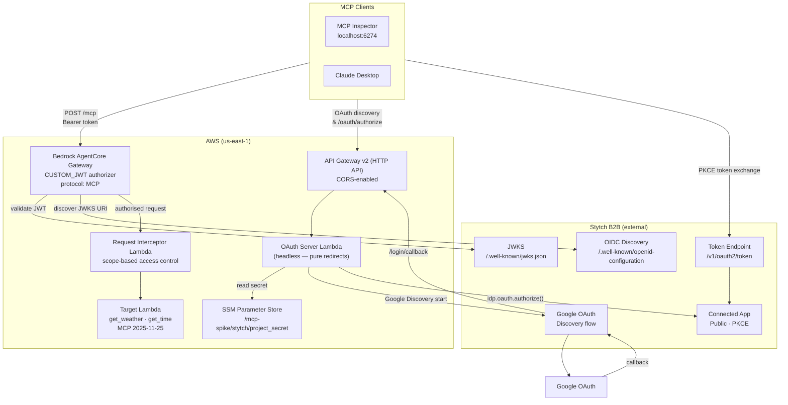
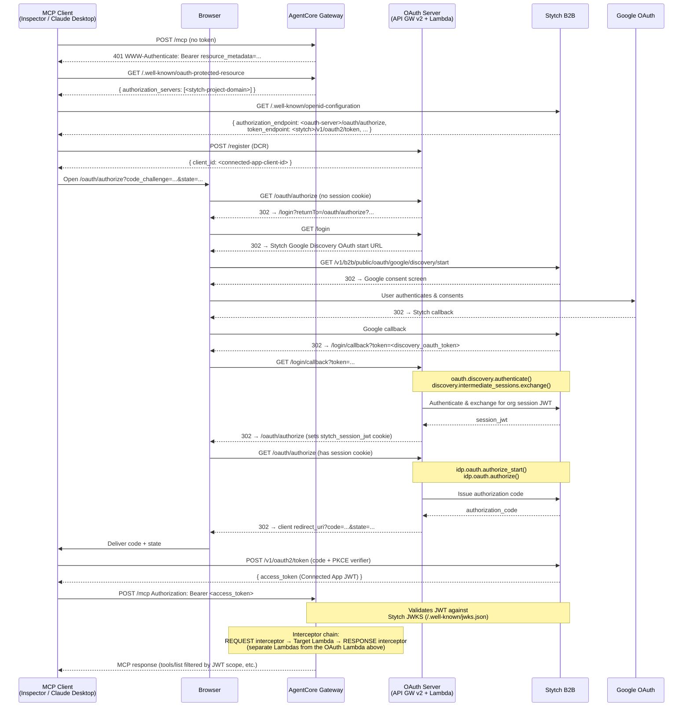

# AgentCore MCP Gateway — Stytch B2B OAuth Auth Spike

Demonstrates how to front an MCP server hosted on **Amazon Bedrock AgentCore Gateway** with a full **OAuth 2.0 Authorization Code + PKCE** login flow backed by **Stytch B2B Google OAuth** (Discovery flow), using AWS Lambda, API Gateway v2 (HTTP API), and CDK — no Cognito, no CloudFront.

## Architecture

### Component Architecture



### OAuth Flow Sequence



**Key design decisions:**

- **Stytch B2B Discovery OAuth flow**: users authenticate via Google → Stytch issues an `intermediate_session_token` → Lambda exchanges it for a full org session. No need for users to know their org slug.
- **AgentCore `CUSTOM_JWT` authorizer** owns token validation. Its `discovery_url` points to Stytch's own OIDC discovery doc, which provides the correct `jwks_uri`. AgentCore validates every request before any Lambda is invoked.
- **Headless OAuth Lambda**: no HTML served — all flows are pure HTTP redirects. Compatible with browser-based OAuth initiated by MCP clients.
- **Stytch Connected Apps**: after login, the Lambda calls `stytch.idp.oauth.authorize_start()` then `stytch.idp.oauth.authorize()` to issue a standard `authorization_code`. The MCP client exchanges this with Stytch's token endpoint for a Connected App `access_token`.

## Components

| Component | File | Purpose |
|---|---|---|
| CDK stack | `cdk/stacks/mcp_auth_spike_stack.py` | All AWS resources (AgentCore Gateway, API Gateway v2, Lambdas, SSM) |
| Stack settings | `cdk/stacks/settings.py` | `pydantic-settings` loader that reads `.env` |
| OAuth server | `lambdas/oauth_server.py` | OIDC/AS discovery, login, Google OAuth callback, authorization code issuance, DCR |
| Request interceptor | `lambdas/request_interceptor.py` | Blocks `tools/call` for tools the JWT caller lacks scope for |
| Response interceptor | `lambdas/response_interceptor.py` | Filters `tools/list` responses to only tools the JWT caller has scope for |
| Target Lambda | `lambdas/target.py` | Dummy MCP server (`get_weather`, `get_time`, MCP `2025-11-25`) |

### OAuth Lambda Endpoints

| Method | Path | Description |
|---|---|---|
| `GET` | `/.well-known/openid-configuration` | OIDC discovery — consumed by AgentCore (points to Stytch JWKS) |
| `GET` | `/.well-known/oauth-authorization-server` | RFC 8414 AS metadata — consumed by MCP clients |
| `GET` | `/.well-known/oauth-protected-resource` | RFC 9728 protected resource metadata |
| `POST` | `/register` | RFC 7591 Dynamic Client Registration (returns pre-registered Connected App `client_id`) |
| `GET` | `/oauth/authorize` | Checks session cookie; absent → `/login`; present → calls Stytch `idp.oauth.authorize()` → redirect |
| `GET` | `/login` | Redirects user to Stytch B2B Google Discovery OAuth start URL |
| `GET` | `/login/callback` | Stytch callback: exchanges token for org session JWT, sets cookie, redirects to `/oauth/authorize` |

## Repository Layout

```text
.
├── cdk/
│   ├── app.py
│   ├── cdk.json
│   ├── requirements.txt
│   └── stacks/
│       ├── mcp_auth_spike_stack.py
│       └── settings.py
├── lambdas/
│   ├── oauth_server.py
│   ├── request_interceptor.py
│   ├── response_interceptor.py
│   ├── target.py
│   └── requirements.txt
├── .env.example         # template — copy to .env and fill in
├── .gitignore
├── pyproject.toml
├── uv.lock
└── README.md
```

## Prerequisites

| Tool | Notes |
|---|---|
| AWS CLI | Configured with credentials |
| Python 3.12+ | Repo uses 3.13 |
| Node.js 18+ | For CDK CLI |
| `uv` | Dependency management |
| Docker | Running — CDK bundles Lambda deps via Docker |

```bash
aws --version && python3 --version && node --version && uv --version && docker info --format '{{.ServerVersion}}'
```

---

## Setup

### Stytch project — end-to-end checklist

When spinning up a fresh Stytch B2B project, run through these steps in order. Each step links to the detailed instructions further down. Steps marked **(pre-deploy)** can be done before `cdk deploy`; steps marked **(post-deploy)** need the URLs that the first deploy prints.

**Pre-deploy (Stytch Dashboard):**

1. **Create the B2B project** (test env is fine) → from *Dashboard → API Keys* copy **Project ID**, **Project Domain**, **Public Token**, and **Secret**. → [1a](#1a--create-project--note-credentials)
2. **Enable Google OAuth** → *Dashboard → OAuth → Google*. Supply Google Cloud OAuth client ID + secret. → [1b](#1b--enable-google-oauth)
3. **Create an Organization** → *Dashboard → Organizations → Create organization*. Copy the **Organization ID**. → [1c](#1c--create-an-organization)
4. **Invite members** → add the Google account(s) you will log in with. Required — without it the discovery exchange returns `invalid_intermediate_session_token_for_organization`. → [1d](#1d--add-members-to-the-org)
5. **Create a Public Connected App** → *Dashboard → Connected Apps → Create app → Public*. Copy the **Client ID**. Authorization URL can be left as a placeholder for now (it is updated in step 10). → [1e](#1e--create-a-connected-app)
6. **Register MCP client redirect URIs** on the Connected App (Inspector: `http://localhost:6274/oauth/callback`, Claude Desktop: `https://claude.ai/api/mcp/auth_callback`, plus any others you use). → [1f](#1f--register-connected-app-redirect-uris)

**Pre-deploy (AWS + local):**

7. **Store the Stytch secret in SSM** at `/mcp-spike/stytch/project_secret` (SecureString). → [2](#2--ssm-parameter)
8. **Copy `.env.example` → `.env`** and fill in the Stytch values from steps 1–5. Leave `OAUTH_LAMBDA_URL` and `AGENTCORE_GATEWAY_URL` as placeholders. → [3](#3--configure-the-stack)
9. **First `cdk deploy`** → note the `OAuthServerUrl` (API Gateway URL) and `GatewayArn` outputs. → [4](#4--deploy)

**Post-deploy (Stytch Dashboard + redeploy):**

10. **Set the Connected App Authorization URL** to `<OAuthServerUrl>oauth/authorize`. Stytch reads this on every request; no redeploy needed for this change. → [1e](#1e--create-a-connected-app)
11. **Add the Login callback** at *Dashboard → Redirect URLs* (top-level, **not** inside the Connected App): `<OAuthServerUrl>login/callback`, type **Login**, status **Enabled**. → [5](#5--add-login-callback-to-stytch-redirect-urls)
12. **Fill in `OAUTH_LAMBDA_URL` and `AGENTCORE_GATEWAY_URL`** in `.env` from the deploy outputs, then **redeploy** (`cdk deploy`) so the OAuth Lambda learns its own URL and AgentCore picks up the correct `allowed_audience`. → [4](#4--deploy)

After step 12 the flow is ready to test with [MCP Inspector](#testing-with-mcp-inspector) or [Claude Desktop](#testing-with-claude-desktop).

> **Re-deploying / re-creating the stack changes the API Gateway URL.** When that happens, redo steps 10 and 11 with the new URL, otherwise clients will hit the stale endpoint via Stytch's OIDC discovery doc and see `Got message null {"Message":null}`.

---

### 1 — Stytch B2B Console

Complete the following steps in [stytch.com](https://stytch.com) **before** running CDK deploy.

#### 1a — Create project & note credentials

1. Create a **B2B** project (test environment is fine).
2. From **Dashboard → API Keys**, note:
   - **Project ID** (e.g. `project-test-...`)
   - **Project domain** (e.g. `https://<slug>.customers.stytch.dev`)
   - **Public token** (e.g. `public-token-test-...`)
   - **Secret** (needed for SSM — see step 2)

#### 1b — Enable Google OAuth

1. Go to **OAuth** → **Google**.
2. Enable Google as an OAuth provider.
3. Follow the on-screen instructions to provide your Google Cloud OAuth credentials (Client ID + Client Secret from [Google Cloud Console](https://console.cloud.google.com) → APIs & Services → Credentials → OAuth 2.0 Client IDs).

#### 1c — Create an organization

1. Go to **Organizations → Create organization**.
2. Note the **Organization ID** (e.g. `organization-test-...`).

#### 1d — Add members to the org

1. Inside the organization, go to **Members → Invite member**.
2. Add the Google account(s) that will authenticate through the MCP flow.

> Without this step, `discovery.intermediate_sessions.exchange()` will reject the login with `invalid_intermediate_session_token_for_organization`.

#### 1e — Create a Connected App

1. Go to **Connected Apps → Create app**.
2. Choose **Public** (no client secret — required for PKCE).
3. Set the **Authorization endpoint** to your OAuth API Gateway URL + `oauth/authorize`:
   ```
   https://<api-id>.execute-api.<region>.amazonaws.com/oauth/authorize
   ```
   You will know this URL after the first CDK deploy (see step 4). Stytch reads this field on each request, so you can create the app now with a placeholder and update it after deploy — no redeploy required.
4. Note the **Client ID** (e.g. `connected-app-test-...`).

#### 1f — Register Connected App redirect URIs

Under **Connected Apps → [your app] → Redirect URIs**, add a URI for each MCP client you plan to use:

| Client | Redirect URI |
|---|---|
| MCP Inspector | `http://localhost:6274/oauth/callback` |
| Claude Desktop | `https://claude.ai/api/mcp/auth_callback` |

> Stytch rejects `idp.oauth.authorize()` calls with `connected_app_supplied_redirect_url_not_found_in_client` if the client's `redirect_uri` is not in this list. Add each client's URI before testing with that client.

### 2 — SSM Parameter

Create this before the first deploy:

```bash
aws ssm put-parameter \
  --name "/mcp-spike/stytch/project_secret" \
  --type SecureString \
  --value "<your-stytch-b2b-secret>"
```

### 3 — Configure the Stack

Copy `.env.example` → `.env` and fill in the Stytch values. `cdk/stacks/settings.py` loads these via `pydantic-settings` and passes them into the stack:

```bash
cp .env.example .env
```

```ini
# Stytch B2B project (from Dashboard → API Keys)
STYTCH_PROJECT_ID=project-test-...
STYTCH_PROJECT_DOMAIN=https://<slug>.customers.stytch.dev
STYTCH_ORG_ID=organization-test-...
STYTCH_PUBLIC_TOKEN=public-token-test-...

# Connected App (from Dashboard → Connected Apps → your app)
CONNECTED_APP_CLIENT_ID=connected-app-test-...

# Filled in after the first deploy (see CDK outputs)
OAUTH_LAMBDA_URL=
AGENTCORE_GATEWAY_URL=
```

On the first deploy, leave `OAUTH_LAMBDA_URL` and `AGENTCORE_GATEWAY_URL` as the placeholders shown in `.env.example`. Deploy once to learn the real URLs, then fill them in and redeploy.

The stack automatically points AgentCore's `discovery_url` at Stytch's own OIDC discovery endpoint (`{STYTCH_PROJECT_DOMAIN}/.well-known/openid-configuration`) — Stytch is always authoritative for the JWKS. `allowed_audience` is set from `AGENTCORE_GATEWAY_URL` so Connected Apps tokens whose `aud` claim matches the MCP server URL are accepted.

### 4 — Deploy

```bash
uv sync --all-groups
source .venv/bin/activate
cd cdk
cdk bootstrap   # one-time per account+region
cdk deploy
```

CDK outputs:

| Output | Description |
|---|---|
| `OAuthServerUrl` | API Gateway v2 HTTP API base URL — OAuth server base (use this for `OAUTH_LAMBDA_URL` in `.env`) |
| `GatewayArn` | ARN of the AgentCore Gateway. Look up the Gateway URL in the Bedrock console (*AgentCore → Gateways → McpAuthSpikeGateway*) — it has the form `https://<gateway-id>.gateway.bedrock-agentcore.<region>.amazonaws.com/mcp`. Use that for `AGENTCORE_GATEWAY_URL` in `.env`. |
| `RequestInterceptorArn` | ARN of the request interceptor Lambda |
| `ResponseInterceptorArn` | ARN of the response interceptor Lambda |

After filling in `OAUTH_LAMBDA_URL` and `AGENTCORE_GATEWAY_URL` in `.env`, run `cdk deploy` again so the OAuth Lambda picks up its own URL and AgentCore picks up the correct `allowed_audience`.

### 5 — Add Login Callback to Stytch Redirect URLs

This is a **different place** from the Connected App Redirect URIs in step 1f. This URL is where Stytch sends the user after Google OAuth completes (the Discovery flow callback). It must be registered in **Stytch Dashboard → Redirect URLs** (not inside the Connected App).

After the first deploy, go to **Stytch Console → Redirect URLs** and add:

```
https://<api-id>.execute-api.<region>.amazonaws.com/login/callback
```

Set type to **Login** and status to **Enabled**.

You can also update the Connected App **Authorization endpoint** (step 1e) at this point if you deferred it:

```
https://<api-id>.execute-api.<region>.amazonaws.com/oauth/authorize
```

> If the API Gateway URL ever changes (tearing the stack down and redeploying, renaming the `OAuthApi` construct, etc.), you **must** update both URLs above in the Stytch Dashboard. Stytch's own OIDC discovery doc at `https://<slug>.customers.stytch.dev/.well-known/openid-configuration` exposes the Connected App Authorization URL as its `authorization_endpoint`, and MCP clients follow it verbatim — a stale value there leaves the client hitting a dead endpoint.

---

## Testing with MCP Inspector

```bash
npx @modelcontextprotocol/inspector
```

| Field | Value |
|---|---|
| Transport | Streamable HTTP |
| URL | `https://<gateway-id>.gateway.bedrock-agentcore.<region>.amazonaws.com/mcp` |

Click **Connect**. AgentCore returns `401` + `WWW-Authenticate`. Inspector follows the OAuth discovery chain, opens a browser for Google login, completes the Stytch B2B Discovery flow, exchanges the authorization code for a Stytch Connected App access token, and reconnects. AgentCore validates the token and the connection succeeds. `tools/list` returns the target-namespaced tools (`DummyToolsTarget___get_weather`, `DummyToolsTarget___get_time`), filtered by the JWT's `scope` claim — see [Scope-based tool access control](#scope-based-tool-access-control) for how that filtering works.

---

## Testing with Claude Desktop

Claude Desktop has two code paths for MCP servers:

| Server type | Configured via |
|---|---|
| Local stdio servers | `claude_desktop_config.json` (`~/.config/Claude/...` on Linux, `~/Library/Application Support/Claude/...` on macOS) |
| **Remote HTTP servers with OAuth** (this stack) | **Settings → Connectors → Add custom connector** |

Since this is an HTTP + OAuth MCP server, use the **Custom Connectors UI**, not `claude_desktop_config.json`:

1. **Settings → Connectors → Add custom connector**.
2. **URL**: `https://<gateway-id>.gateway.bedrock-agentcore.<region>.amazonaws.com/mcp`
3. Save. On first use Claude Desktop opens a browser for Google OAuth, stores the token, and reconnects automatically on subsequent starts.

The Custom Connectors UI has no field for custom scopes — Claude Desktop just requests `openid` at the moment. The OAuth Lambda compensates for this by server-side scope injection (see [Scope-based tool access control](#scope-based-tool-access-control) below).

> **Prerequisite**: `https://claude.ai/api/mcp/auth_callback` must be registered as a Redirect URI in your Stytch Connected App (Setup step 1f).

---

## Scope-based tool access control

The gateway has two interceptor Lambdas that together restrict which tools each user sees and can call, keyed off the `scope` claim in the Stytch Connected App JWT:

| Interceptor | Hook | What it does |
|---|---|---|
| `lambdas/request_interceptor.py` | `REQUEST` | On `tools/call`, decodes the JWT, checks the `scope` claim, and short-circuits with a JSON-RPC error if the caller lacks the required scope for that tool. |
| `lambdas/response_interceptor.py` | `RESPONSE` | On `tools/list`, decodes the JWT (from `pass_request_headers=True`) and drops tools the caller has no scope for, so they never appear in the client's tool picker. |

Both use the same scope convention (`lambdas/request_interceptor.py:31`, `lambdas/response_interceptor.py:39`). Tool names are namespaced by the target (`DummyToolsTarget___get_weather`); each interceptor strips the `___` prefix via `_unprefix_tool()` before looking up scopes.

| Scope in JWT | Effect |
|---|---|
| `tool:get_weather` | `get_weather` visible and callable |
| `tool:get_time` | `get_time` visible and callable |
| `tool:*` | all tools visible and callable |
| no `tool:` scopes present | **default-open**: all tools visible and callable (useful before you configure any scopes — turn into default-deny by removing the `not any(s.startswith("tool:")...)` early-return in both files) |

> The `tools/list` filter is cosmetic, not a security boundary. The authoritative check is the request interceptor on `tools/call` — always keep that in sync with the response filter.

### Configure custom scopes in Stytch (B2B RBAC)

In Stytch B2B, Connected Apps don't have a per-app "Scopes" tab. Custom scopes live in the **Project's RBAC Policy**. Scopes and Roles are siblings — both bundle **permissions** (a permission is a resource + action). At token-issue time Stytch intersects them: a member's token includes a scope only if every permission that scope declares is also granted by one of the member's roles.

```
Resource + Action ──► Permission ──► (consumed by both)
                                     ├─► Scope  (included in OAuth token if…)
                                     └─► Role   (…member's roles cover all the scope's permissions)
        ↑                                            ↑
        └── define once in RBAC Policy               └── assign to Member in Organization
```

Follow these steps in order:

1. **Stytch Dashboard → RBAC Policy → Resources.** Create a resource for the MCP tools (e.g. `tools`) with one action per tool:
   - `get_weather`
   - `get_time`

2. **Stytch Dashboard → RBAC Policy → Scopes.** Create one scope per access level and attach the matching permission(s). Pick names that match what the interceptors expect — the stack's interceptors look for `tool:get_weather`, `tool:get_time`, `tool:*`:
   | Scope name | Permissions it grants |
   |---|---|
   | `tool:get_weather` | `tools.get_weather` |
   | `tool:get_time` | `tools.get_time` |
   | `tool:*` | `tools.*` |

   Scope names are free-form strings; Stytch passes them through verbatim into the token's `scope` claim.

3. **Stytch Dashboard → RBAC Policy → Roles.** Roles are bundles of **permissions**, not of scopes. Mirror each scope by giving the role the same permissions the scope needs — then that role "covers" the scope at token-issue time:
   | Role | Permissions (resource.action) |
   |---|---|
   | `weather-user` | `tools.get_weather` |
   | `time-user` | `tools.get_time` |
   | `tools-admin` | `tools.*` |

4. **Organizations → your org → Members → [member] → Roles.** Assign the right role to each member. A member's token will include exactly the scopes whose permissions are all covered by that member's roles — any scope requested by the client but not covered is silently dropped.

5. **No client-side scope request needed** (server auto-injects — see [Server-side scope injection](#scope-based-tool-access-control) below). By default `_oauth_authorize` in the OAuth Lambda appends every entry from `_CUSTOM_SCOPES` onto whatever the client requested, before forwarding to Stytch. Stytch then intersects that list with the scopes the member's roles actually cover, so each member gets exactly the tool scopes they're entitled to regardless of whether the client asked for them. This is what makes Claude Desktop (which has no scope config) work identically to Inspector. The resulting authorize call to Stytch looks like:
   ```
   scope=openid+tool:get_weather+tool:get_time+tool:*   (sent by the Lambda)
   scope=openid+tool:get_weather                        (granted by Stytch for a weather-user)
   ```
   If you prefer the client to be explicit (least-privilege), you can request scopes directly; they'll be merged with the auto-injected set.

6. **Verify** by decoding the resulting access token and checking the `scope` claim:
   ```bash
   python3 -c "
   import base64, json, sys
   payload = sys.argv[1].split('.')[1] + '=='
   print(json.loads(base64.urlsafe_b64decode(payload)))
   " <access_token>
   ```
   You should see e.g. `"scope": "openid email tool:get_weather"`. With that token, `tools/list` returns only `get_weather`, and `tools/call get_time` returns *"Insufficient scope for tool: get_time"*.

> **Default-open fallback.** If a member's token contains **no scopes starting with `tool:`** (for example because you haven't set up the RBAC policy yet, or the member has no matching role), the current interceptors fall back to "allow everything" so the spike keeps working. Once the RBAC policy is the source of truth, flip the `if not any(s.startswith("tool:") for s in scopes): return True` early-return in both `lambdas/request_interceptor.py` and `lambdas/response_interceptor.py` to enforce default-deny.

**Advertised scopes.** `lambdas/oauth_server.py` advertises `scopes_supported` in `/.well-known/oauth-authorization-server`, `/.well-known/openid-configuration`, and `/.well-known/oauth-protected-resource`. The list is `openid email profile` plus the custom scopes from `_DEFAULT_CUSTOM_SCOPES` (= `tool:get_weather`, `tool:get_time`, `tool:*`). Clients that gate requested scopes on DCR metadata (some Inspector versions do) will pick them up automatically.

If you change the scope names in your RBAC policy, override the defaults with the `CUSTOM_SCOPES` env var on the OAuth Lambda (comma-separated, e.g. `tool:read,tool:write,tool:*`). No code change needed — just set the env var and redeploy.

**Server-side scope injection (for clients that can't configure scopes).** Claude Desktop's remote Custom Connectors UI has no field for custom scopes, and it doesn't honour `scopes_supported` in DCR metadata — it always requests just `openid`. To make filtering work for Claude Desktop (and any other MCP client that ignores custom scopes), `_oauth_authorize` in `lambdas/oauth_server.py` unconditionally appends every entry from `_CUSTOM_SCOPES` to the `scopes` list it forwards to Stytch. Stytch then filters against the member's RBAC roles, so nobody gets a scope they aren't entitled to — the client just no longer needs to know what to ask for. Tradeoff: a client can't deliberately request *fewer* scopes than it's entitled to for least-privilege. RBAC remains the authoritative boundary. Look for `"Augmented client scopes"` in the OAuth Lambda logs to see this in action.

---

## AWS Console Navigation

| Resource | Path |
|---|---|
| Gateway | Bedrock → AgentCore → Gateways → McpAuthSpikeGateway |
| Lambda functions | Lambda → Functions → `McpAuthSpikeStack-*` |
| CloudFormation outputs | CloudFormation → McpAuthSpikeStack → Outputs |
| OAuth Lambda logs | CloudWatch → Log groups → `/aws/lambda/McpAuthSpikeStack-OAuthServerLambda*` |
| SSM parameters | Systems Manager → Parameter Store → `/mcp-spike/*` |

---

## Known Issues & Gotchas

### Stytch values live in `.env`
The Stytch project ID, org ID, public token, Connected App client ID, and the post-deploy URLs are read from `.env` by `cdk/stacks/settings.py` (`pydantic-settings`). The project secret is the only credential kept out of `.env` — it lives in SSM at `/mcp-spike/stytch/project_secret`. `.env` is gitignored; treat it as sensitive.

### Stytch Connected App "Authorization URL" drifts after stack recreate
When the API Gateway URL changes (`cdk destroy` + `cdk deploy`, renaming the `OAuthApi` construct, etc.), the Connected App **Authorization URL** and the Stytch **Redirect URLs** must be updated in the Stytch Dashboard. Stytch's OIDC discovery doc echoes the Authorization URL as its `authorization_endpoint`, and MCP clients follow that verbatim — a stale value leaves clients hitting a dead URL (symptoms include a generic `{"Message":null}` / `403 AccessDeniedException` body if the old endpoint still resolves to some AWS service, or a connection failure if it doesn't).

### `authorize_start()` does not accept `state` or `code_challenge`
The Stytch SDK's `idp.oauth.authorize_start()` only accepts `client_id`, `redirect_uri`, `response_type`, `scopes`, and `session_jwt`. The `state`, `code_challenge`, and `resources` parameters belong only to `idp.oauth.authorize()`. Passing them to `authorize_start()` causes a `TypeError` that the OAuth Lambda catches; see next entry for how the error is surfaced.

### `/oauth/authorize` error handling (no more infinite login loops)
`_oauth_authorize` in `lambdas/oauth_server.py` catches Stytch SDK exceptions and classifies them via Stytch's `error_type`:

| Class | Examples | Behavior |
|---|---|---|
| Session expired / invalid | `session_not_found`, `session_expired`, `invalid_session_jwt` | Clear the `stytch_session_jwt` cookie and redirect to `/login?returnTo=…`. |
| Client-input error with a known `redirect_uri` | `oauth_invalid_scope_requested`, `oauth_unauthorized_client`, `oauth_invalid_request` | RFC 6749 §4.1.2.1 error redirect to the client's `redirect_uri` with `?error=<oauth-code>&error_description=…&state=…`. Session cookie is preserved. |
| `redirect_uri`/`client_id` itself is bad | `connected_app_supplied_redirect_url_not_found_in_client`, `connected_app_not_found`, missing `redirect_uri` | Returns a `400 invalid_request` JSON error. Per RFC 6749 we *must not* redirect to an untrusted/missing `redirect_uri`. |
| Anything else | — | Error-redirect to `redirect_uri` with `error=server_error`. |

Historical symptom this replaces: an invalid scope (e.g. typo `tool:get_weathe`) used to clear the session cookie and bounce back to `/login`, which restarted Google OAuth → user appeared stuck on "Choose an account to continue to stytch.com". Now the client gets a proper OAuth error and can show a real failure message.

### AgentCore caches OIDC discovery
If you change `jwks_uri` in the Lambda's discovery doc, AgentCore may continue using the cached value. Point `discovery_url` directly to Stytch's own OIDC endpoint (`https://<slug>.customers.stytch.dev/.well-known/openid-configuration`) — it is always authoritative. Note: the correct Stytch JWKS URL is `/.well-known/jwks.json`; the path `/v1/oauth2/jwks` returns 404.

### Stytch org membership required
The Google account used to log in must be added as a member of the Stytch org. Without this, `discovery.intermediate_sessions.exchange()` returns `invalid_intermediate_session_token_for_organization`. Add members in Stytch Dashboard → Organizations → Members.

### Redirect URIs must be pre-registered
Stytch rejects `authorize()` calls if the `redirect_uri` is not registered in the Connected App. MCP Inspector uses `http://localhost:6274/oauth/callback`; Claude Desktop uses `https://claude.ai/api/mcp/auth_callback`. Both must be added in Stytch Dashboard → Connected Apps → Redirect URIs before use.
